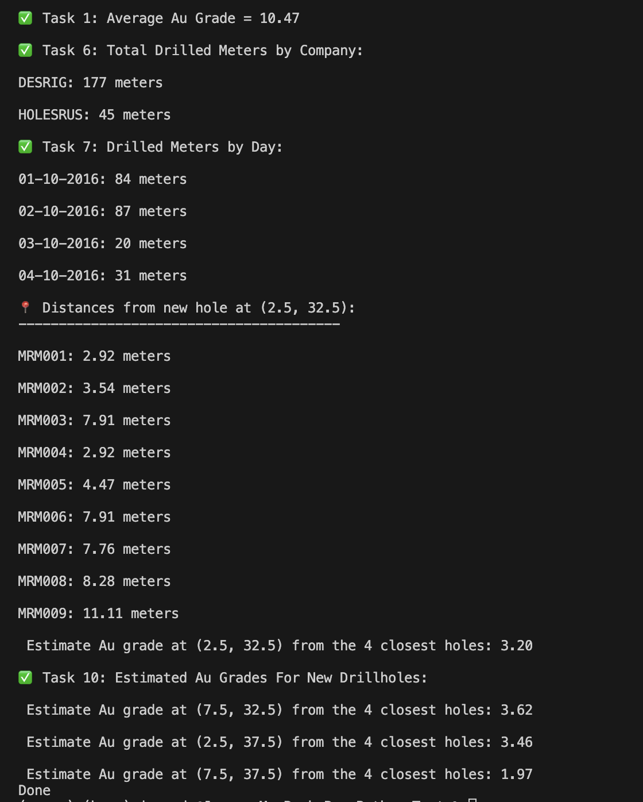

# 🛠️ Drillhole Au Grade Estimator

A Python data engineering project that processes geological drillhole and sample data to compute total drilled meters, estimate gold grades, and generate meaningful insights. 

---

## 📌 Project Objectives

This project simulates a real-world data engineering workflow, covering:

- Parsing Excel datasets
- Data cleaning and validation
- Aggregations by company and date
- Spatial calculations (Euclidean distance)
- Estimating gold grade based on proximity
- Robust error handling and modular Python design

---

## 🚀 Tasks Implemented

| Task # | Description |
|--------|-------------|
| ✅ 1 | Fix bug in average Au grade calculation |
| ✅ 2 | Refactor code for readability and testability |
| ✅ 3 | Unit test for Au grade calculation |
| ✅ 4 | Error handling for missing/invalid data |
| ✅ 5 | Load metadata from `EXTRA_DH_DATA` |
| ✅ 6 | Report total drilled meters by company |
| ✅ 7 | Report total meters drilled per day |
| ✅ 8 | Calculate distances from new holes |
| ✅ 9 | Estimate Au grade using 4 closest holes |
| ✅ 10 | Repeat Au estimation for 3 additional coordinates |

---

## 📸 Sample Output

Below is a sample of the terminal output showing Tasks 1–10 in action:

